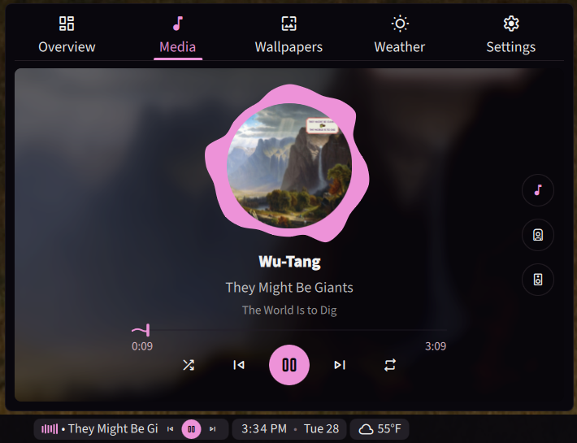

# cider-mpris

MPRIS bridge for [Cider](https://cider.sh/) — exposes Cider's playback as a standard MPRIS media player on Linux, enabling control from desktop widgets, media keys, and `playerctl`.

This exists because Cider's own MPRIS integration is [currently broken](https://github.com/ciderapp/Cider-2/issues?q=is%3Aissue%20state%3Aopen%20mpris). The bridge polls Cider's local HTTP API instead, providing full media control until Cider ships a fix.

**Supported features:** play/pause, next/previous, seek, shuffle, repeat, metadata (title, artist, album, art), position tracking.



## How it works

The bridge polls Cider's local HTTP API (`localhost:10767`) every 500ms and reflects the state on D-Bus as `org.mpris.MediaPlayer2.cider-mpris`. It emits `PropertiesChanged` signals so widgets see track changes, play/pause state, and position updates in real time. The D-Bus name only appears when Cider is actually playing or paused — no empty player widget when Cider is closed.

`playerctl -p cider-mpris` for CLI control.

## Setup

For all cases you'll need a cider app token. Which you can generate inside cider.
Settings > Connectivity > Manage External Appplication Access to Cider

### Nix / Home-Manager

Add to your flake inputs:

```nix
cider-mpris.url = "github:mintchaos/cider-mpris";
```

In your home-manager config:

```nix
{ inputs, ... }: {
  imports = [ inputs.cider-mpris.homeModules.cider-mpris ];
  services.cider-mpris = {
    enable = true;
    rpcTokenFile = /path/to/file/containing/token;
  };
}
```

This installs the binary, creates the systemd user service, and auto-starts the bridge.

The token file should contain just the raw token — no quotes, no newlines:

### Non-Nix (untested)

Requirements: Rust toolchain, a D-Bus session bus.

```bash
# Clone and build
git clone https://github.com/mintchaos/cider-mpris
cd cider-mpris

# Set your Cider RPC token (find in Cider's settings)
echo 'CIDER_RPC_TOKEN=your_token_here' > .env

cargo build --release
./target/release/cider-mpris
```

For auto-start, install the systemd user service manually:

```bash
mkdir -p ~/.config/systemd/user
cp cider-mpris.service ~/.config/systemd/user/
mkdir -p ~/.config/cider-mpris
echo 'CIDER_RPC_TOKEN=your_token' > ~/.config/cider-mpris/env
systemctl --user enable --now cider-mpris
```

## Testing

```bash
playerctl -p cider-mpris status     # Playing / Paused / Stopped
playerctl -p cider-mpris metadata   # Track info
playerctl -p cider-mpris play-pause # Toggle playback
playerctl -p cider-mpris next       # Next track
```
